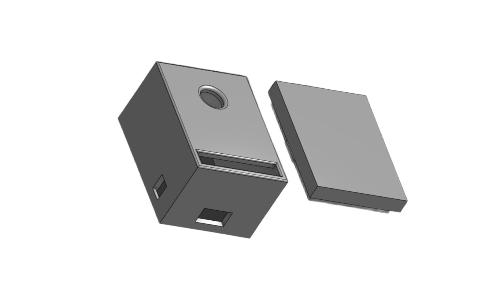

# gwetanocamera
Questo progetto utilizza un ESP32-CAM per fornire uno streaming live MJPEG accessibile via WiFi e consente di catturare e scaricare immagini con un nome univoco.  
Da un idea di @modestinocarbone

## Funzionalità
- **Streaming video live** in formato MJPEG accessibile tramite browser
- **Scatto di foto** con download automatico
- **Access Point WiFi** per connettersi direttamente alla fotocamera senza bisogno di una rete esterna
- **Modello 3D** per stampare un case adatto all'ESP32-CAM nella cartella `model`

## Hardware Necessario
- ESP32-CAM (modello AI-Thinker)
- Modulo FTDI (per programmare l'ESP32-CAM)
- Alimentazione

## Installazione
### 1. Clonare il Repository
```bash
git clone https://github.com/gwetano/gwetanocamera.git
cd gwetanocamera
```

### 2. Caricare il Codice
Aprire il file `camera.ino` con Arduino IDE e:
- Selezionare la scheda **AI Thinker ESP32-CAM**
- Impostare la velocità di upload a **115200 baud**
- Compilare e caricare il codice sull'ESP32-CAM

### 3. Connessione e Accesso
- Dopo l'accensione, l'ESP32-CAM creerà una rete WiFi denominata **CAMERA** con password `password`
- Collegarsi alla rete WiFi e accedere dal browser all'indirizzo `192.168.4.1`

## Modello 3D della Fotocamera
Nella cartella `model` è presente un file STL con il **case personalizzato** per l'ESP32-CAM, pronto per la stampa 3D.


## Licenza
Questo progetto è distribuito sotto la licenza MIT. Sentiti libero di modificarlo e migliorarlo!

## Social
Ho creato un [reel](https://www.instagram.com/reel/DFDGzTYopMK/?utm_source=ig_web_copy_link&igsh=MzRlODBiNWFlZA==) a riguardo 
